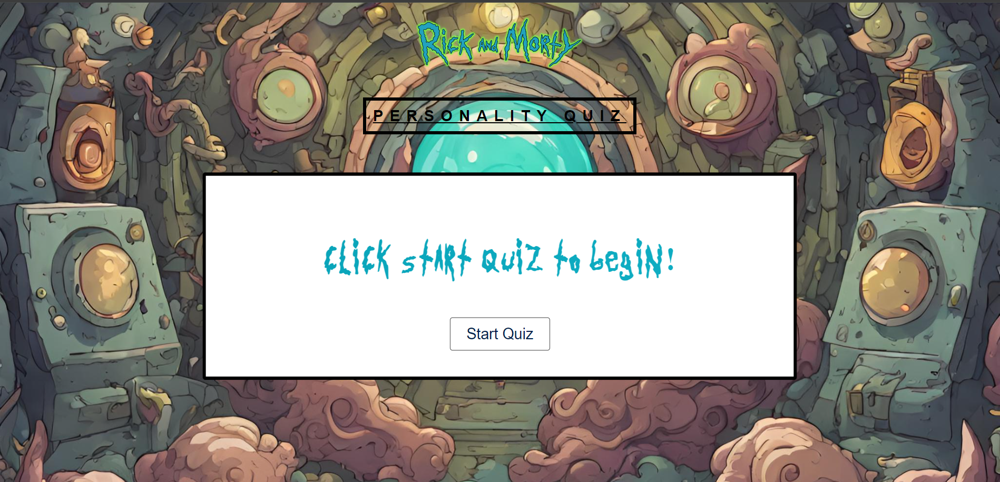
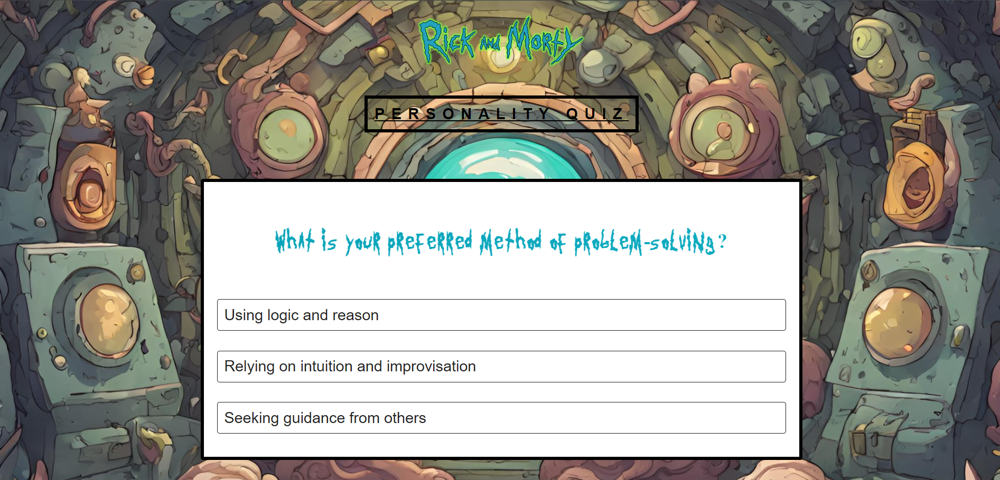
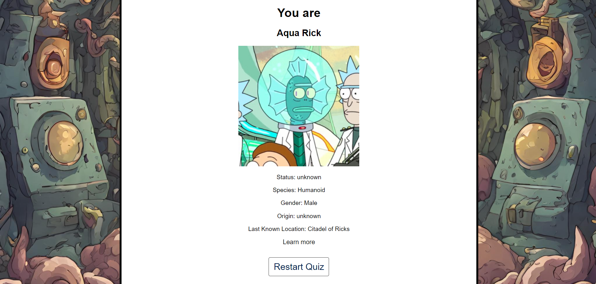

# Rick and Morty Personality Quiz

[Live Site](https://rickandmortypersonalityquiz.netlify.app/)

Welcome to the Rick and Morty Personality Quiz project! This repository contains the code for a fun and interactive personality quiz based on the popular TV show Rick and Morty.

## Overview

This project demonstrates a personality quiz where users answer questions to find out which Rick and Morty character they are most like.

## Features

- **Personality Quiz**: Answer a series of questions to determine your Rick and Morty character.

- **Character Information**: Displays detailed information about the character you match with.

- **Dynamic Results**: Results are fetched dynamically from the Rick and Morty API.

## Technologies Used

- **HTML**: Structure of the web pages.

- **CSS**: Styling of the web pages.

- **JavaScript**: Functionality and interactivity.

- **React.js**: Framework for building the user interface.

- **Axios**: For making requests to the Rick and Morty API.

## How to Run

1. Clone the repository:

```
git clone https://github.com/DominicVCUENG/Rick-And-Morty-Personality-Quiz.git
```

2. Navigate to the project directory:

```
cd Rick-And-Morty-Personality-Quiz
```

3. Install dependencies:

```
npm install
```

4. Start the development server:

```
npm start
```

5. Open your web browser and go to **`http://localhost:3000`** to view the quiz.

## Project Structure

- **`public/`**: Contains public assets including images and the **`index.html`** file.

- **`src/`**: Contains the source code for the application.

  - **`App.js`**: The main component of the application.

  - **`App.css`**: The CSS file for styling the application.

  - **`index.js`**: The entry point for the React application.

- **`package.json`**: Contains the project dependencies and scripts.

## Screenshots







